
<h1 align="center">基于jsp校园二手书交易平台的设计与实现</h1>

## 简介
校园二手书交易平台：角色分为管理员、用户；提供用户注册和登录、二手书浏览和管理、订单管理、在线留言和评论功能，致力于简化校园书籍的二手交易流程。    --计算机毕业设计源码；毕设源码；java毕业设计源码

## 联系方式

<h3 align="center">获取完整代码与数据库文件 + 微信：deepguan QQ: 86050149 QQ群: 783742310</h3>

<h3 align="center">可帮忙远程部署 包运行成功！提供远程部署、修改代码、设计文档指导、代码讲解等服务！</h3>

## 功能介绍（完整见运行截图）
管理员：  
基本功能：登录、注册、退出。  
用户管理：查看、添加、修改、删除用户信息，支持批量操作及筛选。  
订单管理：管理未支付、已支付、已完成订单，支持查看、核销、修改和删除操作。  
商品管理：添加、修改、删除二手书信息，分类管理及推荐设置。  
留言管理：查看、回复、修改、删除用户留言，支持批量操作和内容筛选。  
系统管理：导航栏配置、功能模块管理、系统权限设置。  

用户：  
基本功能：登录、注册、退出。  
商品功能：浏览二手书列表，按分类或关键字搜索，查看书籍详情，加入购物车并结算，支持在线支付。  
个人中心：查看与修改个人信息，管理订单、收藏和地址，上传头像，重置密码。  
留言功能：在线留言、提交建议、上传相关图片，支持评论与回复功能。

## 运行截图
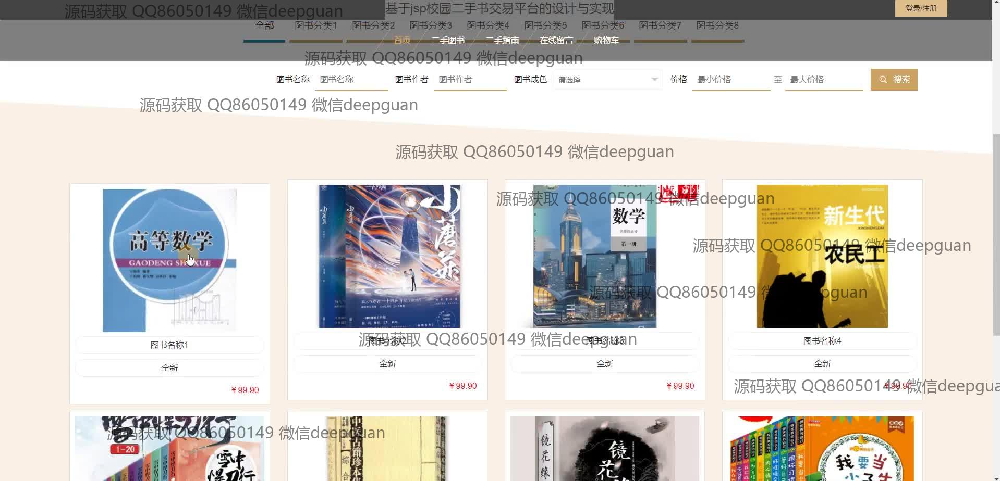
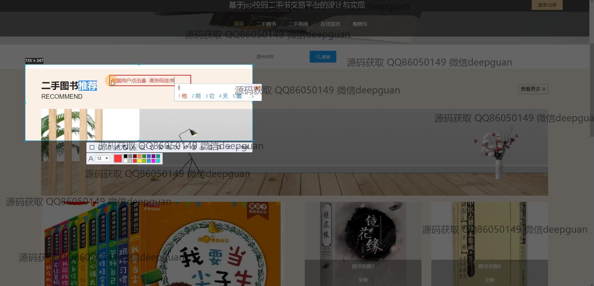

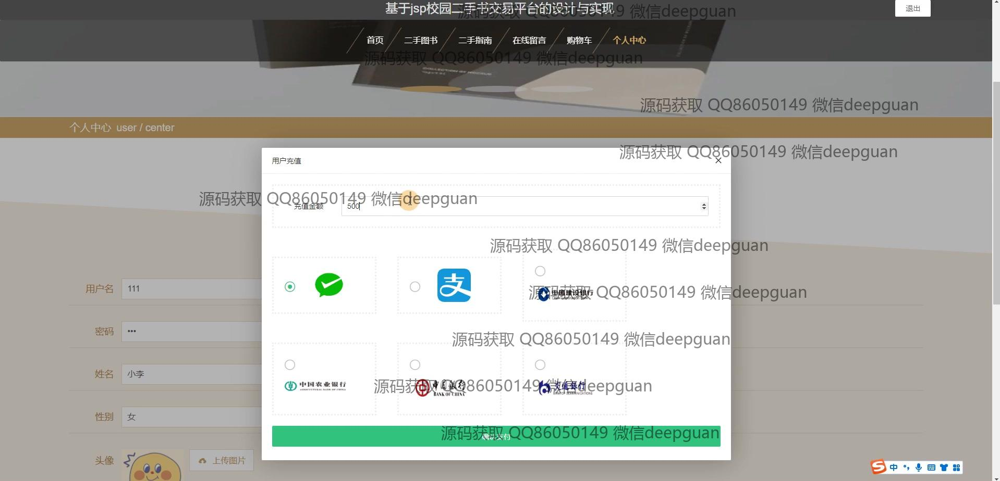
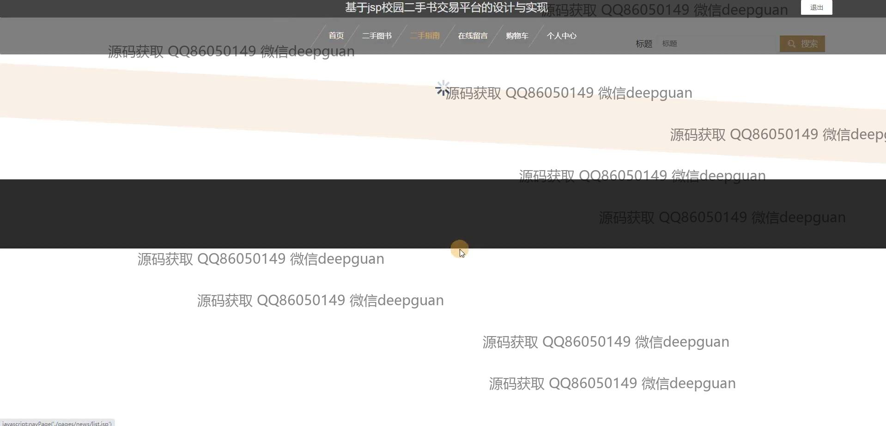
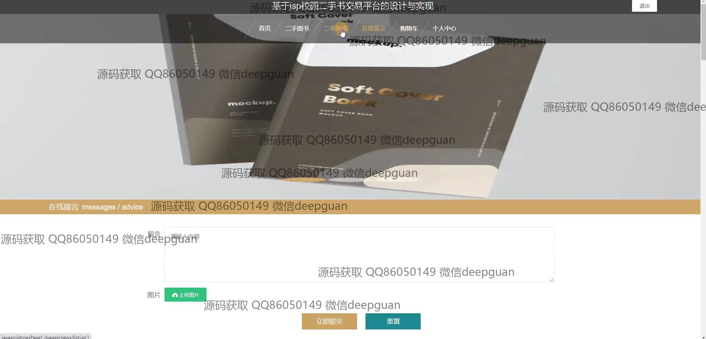
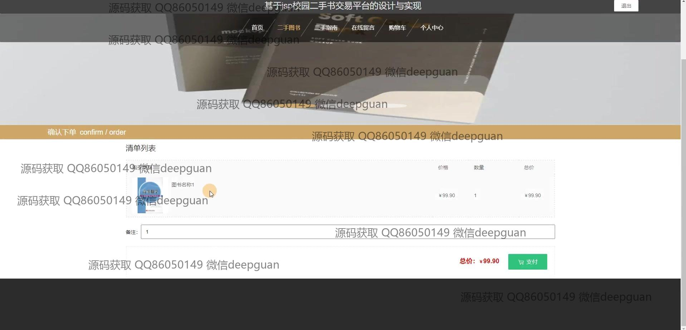
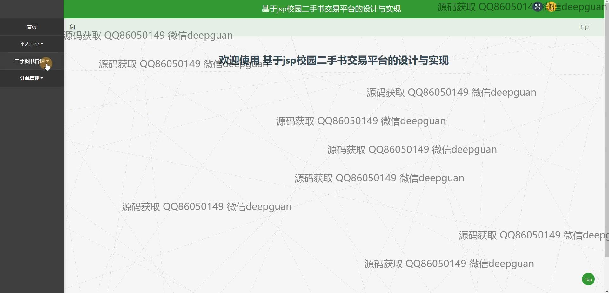

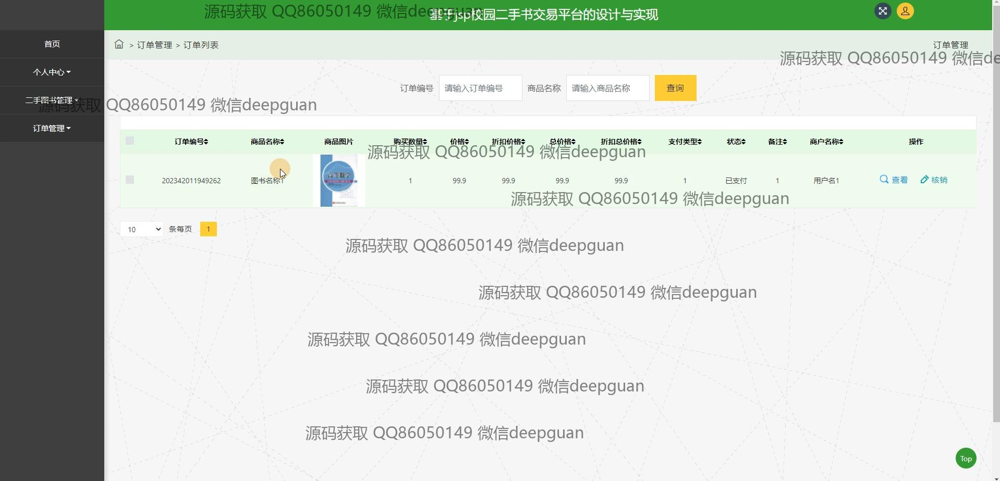
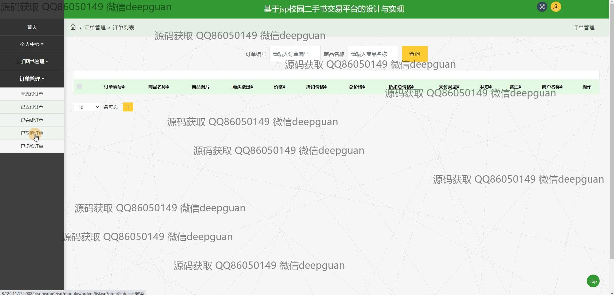
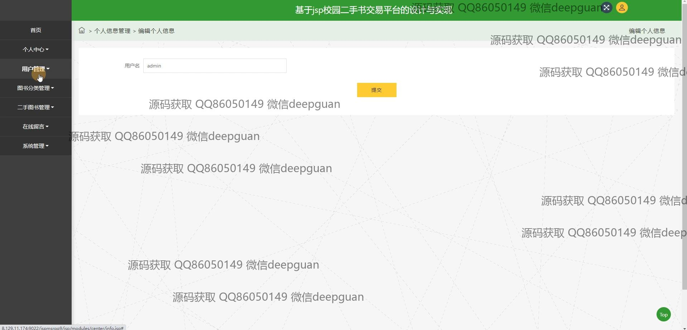
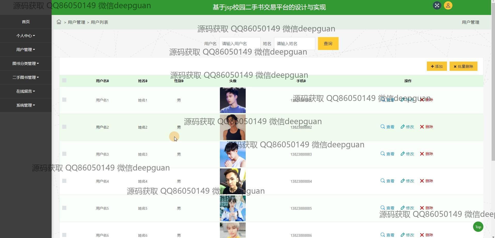
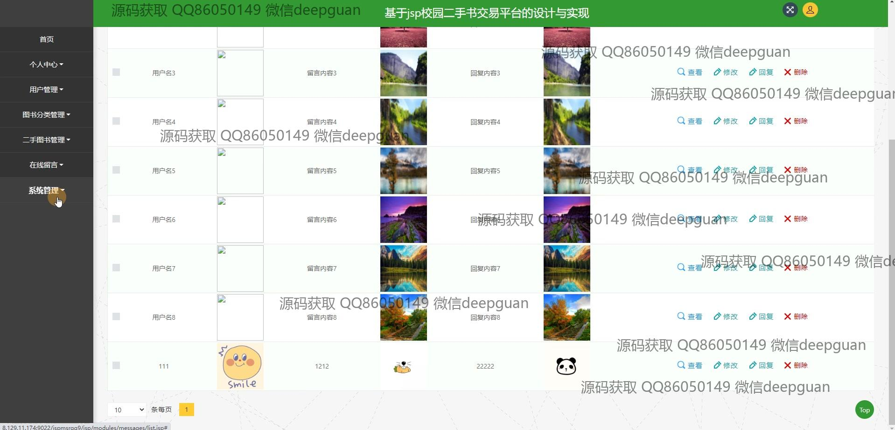
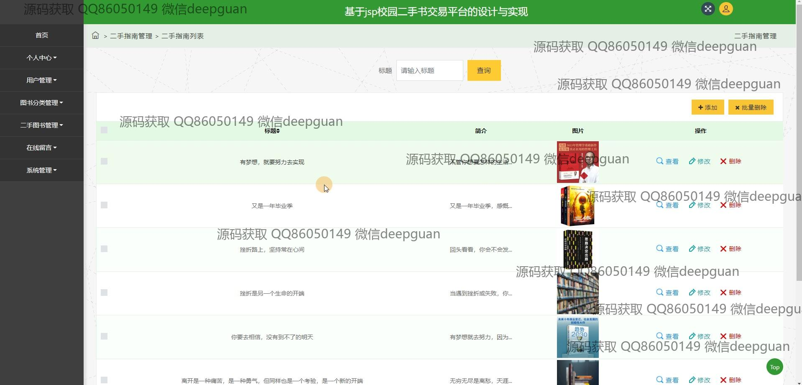

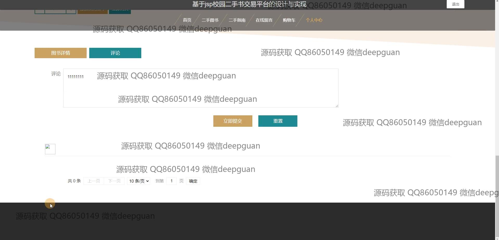
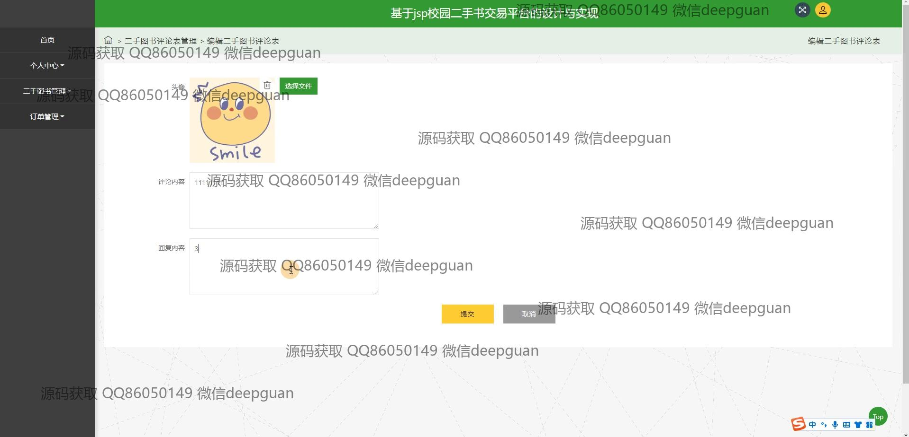

本代码来源于网络,仅供学习参考使用!

